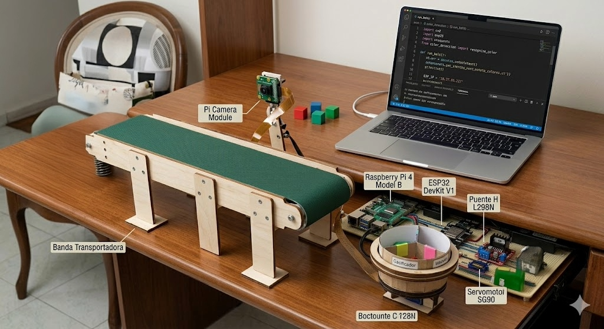

🚀 Clasificador de Objetos IoT con Computer Vision
Este proyecto es un sistema de automatización industrial a escala que combina visión artificial y hardware embebido. Utiliza una Raspberry Pi para el procesamiento de imágenes en tiempo real y una ESP32 para el control de actuadores, comunicados mediante un protocolo de red TCP/IP.

🧠 Lógica de Visión y RobustezA diferencia de sistemas básicos, este software implementa una condición de umbral de área.
Propósito: Filtrar "ruido" visual y elementos pequeños del entorno que no pertenecen al flujo de la banda transportadora.Procesamiento: Se utiliza el espacio de color HSV para una detección precisa bajo diferentes condiciones de iluminación y operaciones morfológicas para limpiar la máscara de detección.

🏗️ Arquitectura Híbrida y Flujo de Datos
El sistema opera bajo un modelo distribuido donde las responsabilidades están claramente separadas:Módulo de Percepción (Raspberry Pi): * Procesa el stream de video de la cámara.Evalúa las condiciones de color y dimensiones.Al validar un objeto, actúa como cliente enviando un trigger JSON vía Socket TCP.Módulo de Actuación (ESP32):Gestiona el movimiento constante de la banda transportadora.Al recibir el dato, activa un servomotor posicionado estratégicamente para desviar el objeto hacia su compartimento de almacenamiento correspondiente (Rojo o Azul).

🛠️ Tecnologías Utilizadas
Visión Artificial: OpenCV (Filtros HSV, Operaciones Morfológicas, Contornos).

Backend & Dashboard: Python 3, Flask, Jinja2.

Hardware Embebido: MicroPython, ESP32, L298N (Puente H), Servomotores.

Comunicación: Sockets TCP/IP, JSON, Multithreading.

DevOps/Buenas Prácticas: Variables de entorno (.env), Git/GitHub.

📐 Arquitectura del Sistema
El proyecto se divide en dos módulos principales que operan de forma asíncrona:

Cerebro (Raspberry Pi 4):

Captura video en tiempo real.

Detecta objetos por color (Rojo/Azul) y filtra ruido ambiental.

Envía una instrucción JSON vía Socket TCP a la ESP32.

Registra cada evento en un datalog.json y lo muestra en un Dashboard web.

Actuador (ESP32):

Gestiona un hilo para el movimiento constante de la banda transportadora.

Escucha peticiones en un puerto específico.

Controla el servomotor para desviar los objetos según el color detectado.

📸 Visualización del Proyecto

  

🚀 Instalación y Configuración
1. Preparación de la Raspberry Pi
Bash
# Clonar el repositorio
git clone https://github.com/AndFeRodriguezB/clasificador-iot-cv.git

# Ir a la carpeta del backend
cd Backend_rasp

# Instalar dependencias
pip install -r requirements.txt

# Configurar variables de entorno
cp .env.example .env
# Edita el archivo .env con la IP de tu ESP32
2. Preparación de la ESP32
Asegúrate de tener instalado el firmware de MicroPython.

Carga los archivos de la carpeta firmware_esp en la placa.

Renombra secrets.py.example a secrets.py y coloca tus credenciales de WiFi.

📊 Dashboard de Monitoreo
El sistema incluye una interfaz web minimalista accesible desde cualquier dispositivo en la red local (Puerto 5000), permitiendo ver el conteo de objetos procesados en tiempo real y un log de eventos con marca de tiempo.

🛡️ Seguridad
Este repositorio sigue buenas prácticas de seguridad industrial:

Las credenciales de red y direcciones IP están protegidas mediante variables de entorno.

Se incluye un archivo .gitignore para evitar la fuga de datos sensibles.

👤 Autor
Tu Nombre

LinkedIn: linkedin.com/in/tu-perfil

Portfolio: [Tu Enlace]